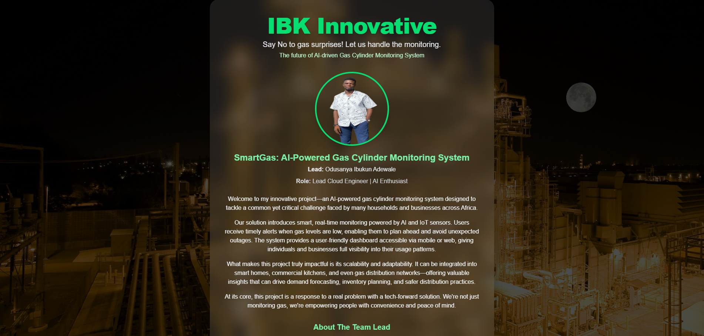
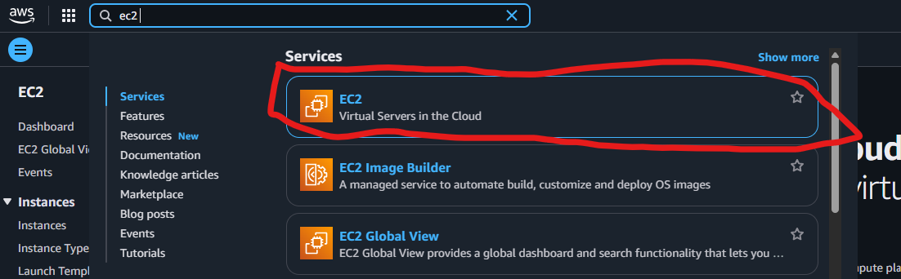
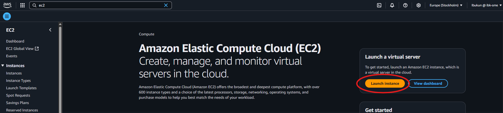
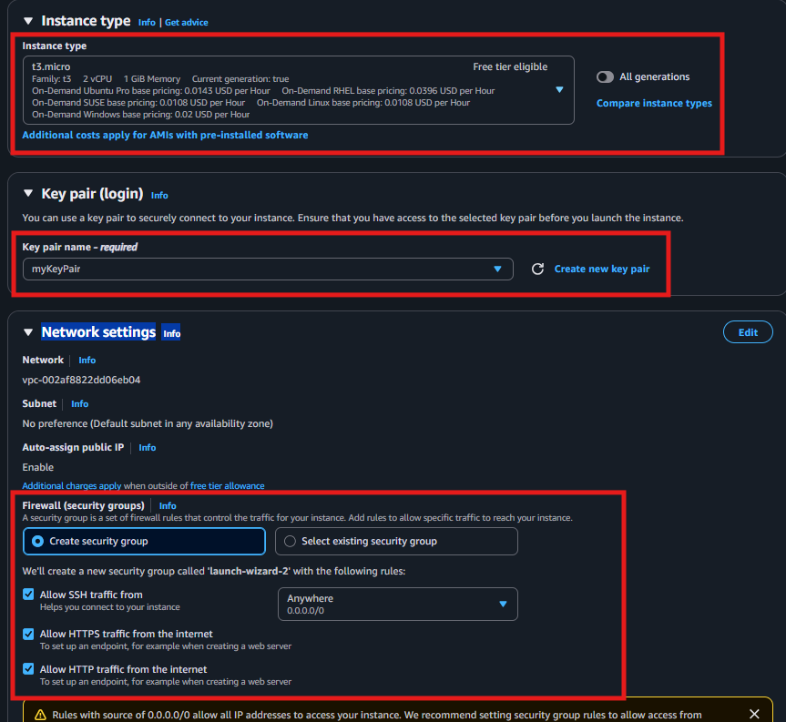
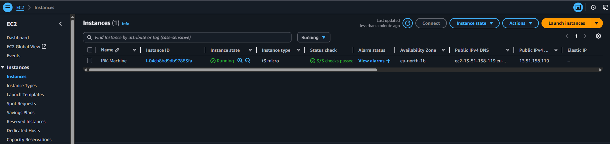
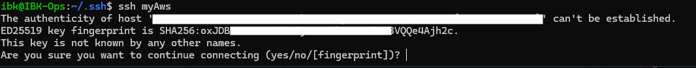
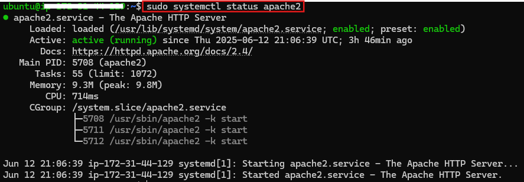
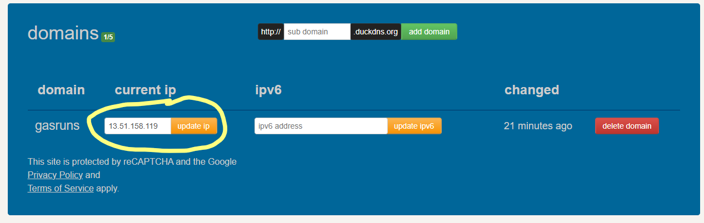

# My Portfolio

Steps Taken to Build and Deploy this Landing page on AWS



### Websit Hosted

-   URL: https://gasruns.duckdns.org/
-   Public IP: https://13.51.158.119/

## Setting up Aws Account and Spining a server

-   We start by visitng [AWS](https://console.aws.amazon.com/) to create a free tier account

-   Then we Spin up a Linux server by creating an EC2 instance in our AWS environment

    -   On our AWS platform in the search bar we search for ec2 and we select Select Ec2 as seen here
        

    -   Click on the Launch instance button to get started
        

    -   We selected our preffered MAchine I will be using Ubuntu, we then select our machine image we are using the free tier image as seen below
        

    -   It is always advisable we select a KeyPair so we give this myKeyPair
        

    -   After which we will Launch our instance and there we have a brand new EC2 instance Ubuntu server  
        

## Accesing Ubuntu Server (WSL on windows)

-   Now we need to access the Server we created from our local machine
-   I am using WSL Linux on windows, you can also [Setup WSL for Windows](https://learn.microsoft.com/en-us/windows/wsl/install)
-   in home directory we create directory called .ssh (if not already created)

    ```bash
    mkdir .ssh
    ```

-   Within the .ssh folder we create a file called `config`

    ```bash
    vi config
    ```

    paste this into the config file we created

    ```
    Host myAws
        Hostname *******
        User ubuntu
        identityfile ~/myKeyPair.pem
    ```

-   The hostname can be gotten from the instance we created on AWS check for `Public DNS` Looks something like ec2-\*\*\*

-   With this approach we will safe our self the time of always typing the hostname and keypair eveytime we want to access our server we will just need to use

    ```
    ssh myAws
    ```

-   We can now SSh into our Server, we should see a message like the image below, type yes and we are good to go

    

## Installing and setting up Apache2

-   Now we need to configure our webserver that will be hosting our HTML and CSS Page using Apache2

    -   We will be running the follwing command

    ### Step 1: Updting Our Server

    ```bash
    sudo apt update
    sudo apt upgrade -y
    ```

    ### Step 2: Installing Apache2

    ```bash
    sudo apt install apache2
    ```

    ### Step 3: Enable and Start Apache

    ```bash
    sudo systemctl enable apache2
    sudo systemctl start apache2
    ```

    ### Step 4: Check Apache Status

    ```bash
    sudo systemctl status apache2
    ```

    

-   We can test our deployment by visiting `http://public_ip` in my case my public IP which could be gotten from AWS platform mine is http://13.51.158.119/

## Building Our website

-   For this website I used Basic HTML and CSS but I used Tailwind for the CSS.
-   Code Is availble on this repo

## Setting up HTTPS with Certbot and DuckDNS.

-   Visit [duckDNS](https://www.duckdns.org/) select a Domain name and replace the current IP with our EC2 public IP
    
-   Signup with any otpion suitable for you.

-   Then we install Certbot On our server

    ```bash
    sudo apt update
    sudo apt install certbot python3-certbot-apache -y "The -y is to autoresponde yes"
    ```

-   we setup our DNS using the Manual DNS Mode

    ```bash
    sudo certbot certonly --manual --preferred-challenges dns -d gasruns.duckdns.org --manual-public-ip-logging-ok

    ```

-   Certbot genrate a one time txt record which we then save in duckDNS by using this URL
    ```yaml
    https://www.duckdns.org/update?domains={domain}.duckdns.org&token={token}&txt={dns_txt}
    ```
-   After seeing a succeful message we configured Apache to use our Certificate
    `bash
    sudo vi /etc/apache2/sites-available/gasruns.duckdns.org.conf
    `
    ```apache
    <VirtualHost \*:80>
        ServerName gasruns.duckdns.org
        Redirect permanent / https://gasruns.duckdns.org/
    </VirtualHost>
    <VirtualHost \*:443>
    ServerName gasruns.duckdns.org

        DocumentRoot /var/www/html

        SSLEngine on
        SSLCertificateFile /etc/letsencrypt/live/gasruns.duckdns.org/fullchain.pem
        SSLCertificateKeyFile /etc/letsencrypt/live/gasruns.duckdns.org/privkey.pem

        <Directory /var/www/html>
            Options -Indexes +FollowSymLinks
            AllowOverride All
        </Directory>

    </VirtualHost>

    ```
- Fially we enabled SSL and reload Apache to sync in our change
    ```bash
    sudo a2enmod ssl
    sudo a2ensite ibukun.duckdns.org.conf
    sudo systemctl reload apache2

    ```